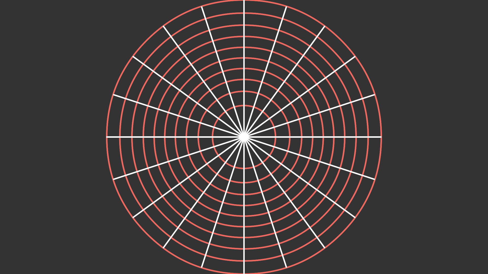

# 微表面模型

## 半球面空间到平面的映射

### 方法

- Stereographic Projection
- 使用笛卡尔坐标系，假设半球面空间定义为在 z 轴上半轴的单位球面
- 光源（投影点）为 (0, 0, -1)
- 投影平面为 z = 0

### 可视化结果

1. 上半球面经纬线的投影（manimgl 实现）
   
2. 令投影点的 (B, G, R) 值分别等于对应半球面上点的 (x, y, z) 坐标的投影（opencv-python 实现）
   