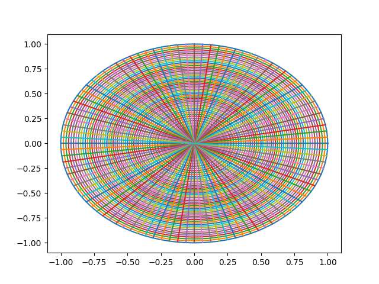
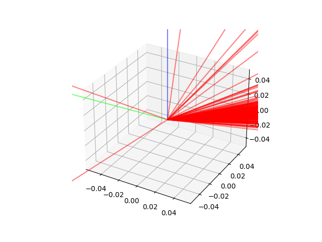
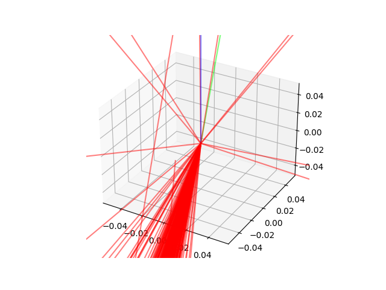
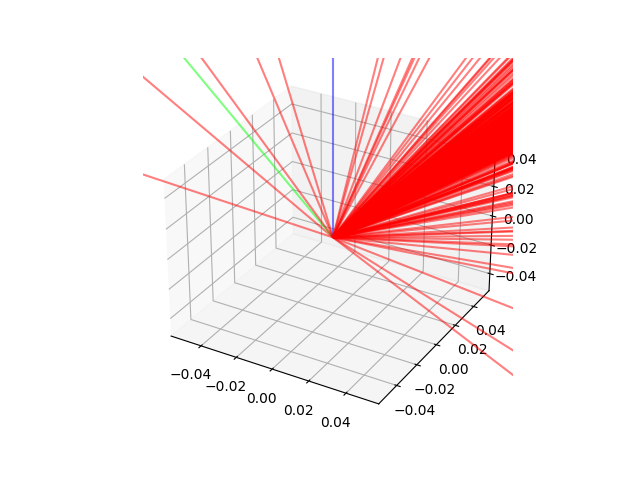

# 微表面模型

## 半球面空间到平面的映射

### 方法

- Stereographic Projection
- 使用笛卡尔坐标系，假设半球面空间定义为在 z 轴上半轴的单位球面
- 光源（投影点）为 (0, 0, -1)
- 投影平面为 z = 0

### 可视化结果

1. 半球面经纬线的投影（matplotlib）
   
2. 投影点在平面上坐标为 (X, Y)，记球面上对应点坐标为 (x, y, z)，令 (X, Y) 对应像素的颜色 (R, G, B) = ((x+1)/2, (y+1)/2, z) 得到的投影（opencv）
   
   

## 材质实现

### Rough Diffuse

### Rough Conductor

## Rough Conductor 材质反射光分布

   

   

   